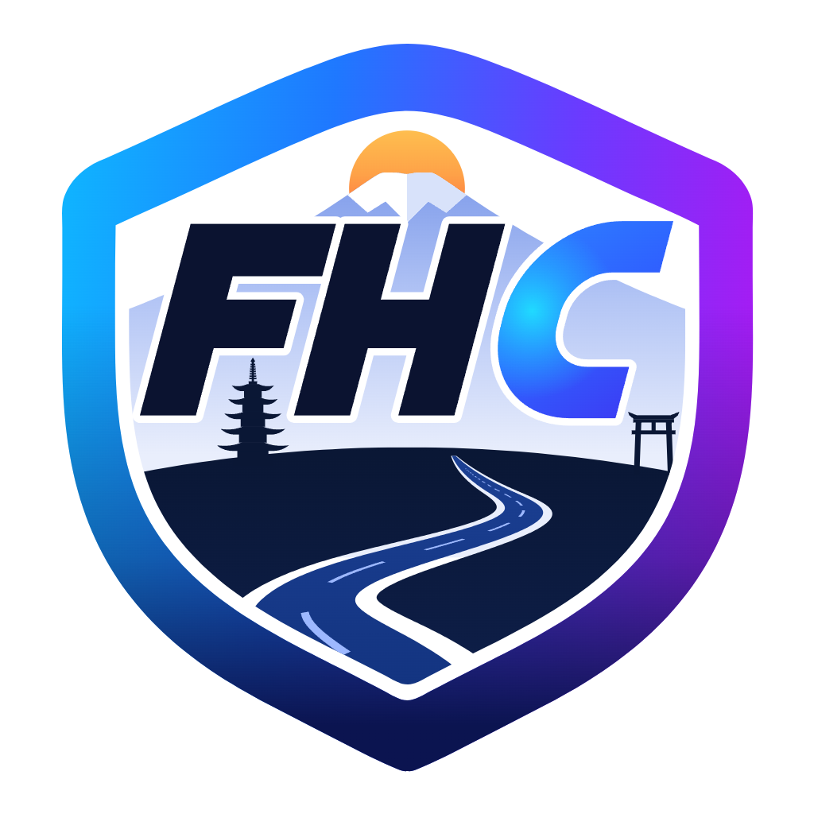

<p align="center">
  <picture>
    <source media="(prefers-color-scheme: dark)" srcset="branding/png/fh-companion-shield-dark-transparent.png">
    
  </picture>
</p>

# FH Companion

A Windows companion app for Forza Horizon 6. It adds an in-game overlay with
route and car advice, a lap delta and live map, and car notes. It also records
your laps and times, shows your tuning and tunes, and drives controller haptics
from the game's telemetry. It comes with a website of car ratings built from the
public Rivals leaderboards.

**Live version:** the car ratings are at
<https://rradick.duckdns.org:8787/rivals_auto_wertung.html>, and the app can be
downloaded from <https://rradick.duckdns.org:8787/app>.

> FH Companion is an unofficial fan project. It is not affiliated with or endorsed
> by Microsoft, Xbox Game Studios or Playground Games. Forza Horizon is a trademark
> of Microsoft.

## About this project

This is a hobby project to test the capabilities of Claude. I am not open to any
discussion about whether I should rewrite everything by hand, or stop, because it
is AI, or anything of that sort.

If you find bugs, have feature requests or want to contribute: be my guest. Open
an issue or a pull request. I am mostly active on Discord, so if you want a quick
reaction, reach me there: <https://discord.gg/A9ssnMXPZf>

## Features

### In-game overlay

Drawn over the game, and only while Forza runs. Every part can be switched off.

- **What to drive.** On the Event Sign Up screen: which cars rank best over
  exactly the three offered routes in that class. Toggle with `F8` or the
  gamepad's View button.
  - Joining a Horizon Play series midway ("2/3"): the ranking covers only the
    races you still drive, and the route already under way counts as done.
  - Laps driven in a series are named after the route that is up next, checked
    against the lap length.
- **Your car.** Which car you are in, and where it places in every category and
  class it has laps in. Toggle with `F6` or a left-stick click.
- **Course maps on the sign-up screen.** An outline of each offered route, drawn
  from your own recorded laps or from the game's Rivals map. The Rivals map
  appears as the game's picture or as a smooth traced line.
  - Tiles sit side by side or stacked.
  - Line thickness and smoothing are adjustable.
  - In a championship, each route is coloured by state: done, now or next.
  - Tiles hide when the race starts or after a time you set.
- **Lap delta.** Time gained or lost against a reference lap, measured at the
  same place on track, not after the same number of seconds.
  - The reference can be the same car and tune, the same car, the same PI class,
    the same car and class, or any lap.
  - In the PI-class and any-lap modes, the label names the reference car.
- **Input strip.** Throttle, brake, clutch, steering and gear.
- **Live map.** The current lap drawn as you drive, with adjustable thickness and
  smoothing. Jumps are drawn as gaps.
- **Car notes in the car menu.** Your own note for the car highlighted in My Cars,
  plus the applied tune's name, tuner and description.
- **Messages.** A short note when a lap or sprint is stored, and a warning when
  you get close to the game's limit for downloaded tunes.
- **Layout editor.** Drag every block where you want it and resize it with the
  mouse wheel. You can preview the result on the real screen.

### Laps and times

- **Every lap recorded** to your disk, with times, positions and speeds.
- **My times.** Your best per car and course, and standings by points and by
  total time.
- **Time attack in free roam.** The game runs no clock outside a race; this does.
  Start and finish lines come from your own laps, and `F10` sets one of your own.
- **Lap submission** to the website when a lap beats the leaderboard. This is on
  by default and needs a gamertag. You can switch it off in the Rivals tab or with
  `"submit_laps": false` in `config/overlay.json`.

### Tuning and tunes

- **Tuning inspector.** What the tune on your car consists of: every fitted part
  with name, step and price, every slider, and where the tune came from. It is
  read from the garage database the game keeps in memory, read-only.
- **Tunes.** How many downloaded tunes you store, measured against the game's
  limit. The tab offers these views:
  - which tunes no car uses;
  - the cars with the most unused tunes;
  - the tuners behind your best laps;
  - the tuners whose tunes you keep most often;
  - a deletion plan for a chosen time frame, grouped by car and tuner.
- **Deleting tunes through the game's menus** *(in progress, not yet in the
  released download).* The app works through the deletion plan in the game
  itself. A test run first goes through everything without deleting, and a tune
  that is on a car is never deleted.

### Controller haptics

- Tyre grip and wheel lock become vibration on the side the car is sliding, out
  of the box, with no curves to set up first.
- Supports the Steam Controller, DualSense (including adaptive triggers), Xbox,
  PlayStation and 8BitDo pads.
- A vibration test, live grip telemetry, a view of all telemetry and outputs, and
  a node editor with Bézier curves that decides how each signal drives each
  actuator.
- **Battery:** vibration costs power. A wireless controller will likely run out
  of battery noticeably faster while the haptics are on, and the stronger and
  faster (higher frequency) you set the vibration, the more power it draws.
  Untick `Graph output enabled` in the Blueprint editor to switch it off.

### The app itself

- **25 languages.**
- **Self-contained.** Nothing to install; the runtime is in the download.
- **Works offline.** The car ratings ship with the download and are refreshed
  from the server when a newer set exists.
- **Signed updates.** The app refuses a package that is not signed by the
  publisher.
- **Idle outside the game.** It stays idle unless Forza runs.
- **Explains itself.** On first start it says what it does on your PC and what
  leaves it, and asks you to confirm.

### Website

The server in `server/` runs the public site:

- car ratings per class (points by finishing position, and the sum of lap times,
  with filters);
- the app download;
- signed uploads for friends who scan boards;
- lap submissions;
- an admin view;
- visitor counts without cookies or tracking.

### Leaderboard scanner

`scripts/` reads the Rivals leaderboards from the running game's memory and from
the screen, and builds the dataset behind the ratings. See
[docs/leaderboard_extractor.md](docs/leaderboard_extractor.md) and
[docs/memory_leaderboard_scanning.md](docs/memory_leaderboard_scanning.md).

## Plans

A separate telemetry tool is planned: it will let you analyse geometric data in
any kind of 3D data. It is a work in progress and not part of this repository yet.

## Documentation

- [docs/app_guide.md](docs/app_guide.md): the app, tab by tab
- [docs/index.md](docs/index.md): every other note (overlay internals, packaging,
  server, scanner, privacy)

## Repository layout

| Folder | What is in it |
|---|---|
| `haptics/ForzaHaptics.Tester` | The app (C#, .NET 9, WinForms). The folder name dates from when it was a haptics test tool. |
| `haptics/ForzaHaptics.Probe`, `haptics/ForzaTelemetry.Probe` | The controller and telemetry probes the app grew out of |
| `server/` | The website |
| `scripts/` | Leaderboard scanning, the data pipeline, packaging, deployment, tests |
| `config/` | Car and route catalogues, translations (`config/lang`), example settings |
| `licenses/` | Full licence texts of the bundled components |
| `docs/` | Notes on every part |

## Building

```powershell
dotnet build haptics/ForzaHaptics.Tester -c Release
```

The self-contained download (runtime, lap records, settings and licences in one
folder):

```powershell
python scripts/build_haptics_package.py
```

See [docs/haptics_package.md](docs/haptics_package.md).

## Settings for your own deployment

Values that belong to one installation stay out of the source. These are the
server address built into the app, the website's public name and its contact
address. Copy `config/local.example.json` to `config/local.json` and fill it in.
That file is ignored by git. Without it the app runs without a server.

`.githooks/pre-commit` runs `scripts/check_no_secrets.py` on every commit. To
enable it:

```powershell
git config core.hooksPath .githooks
```

## Tests

```powershell
python scripts/run_tests.py
```

This runs everything that needs neither the game nor a VM. The app's own
checks run with `"FH Companion.exe" --self-test` (it shows overlays on the
screen) and `--edge-case-test` (no windows).

## Licence

MIT, see [LICENSE](LICENSE). Third-party components and their licences are
listed in [THIRD_PARTY_NOTICES.md](THIRD_PARTY_NOTICES.md).
