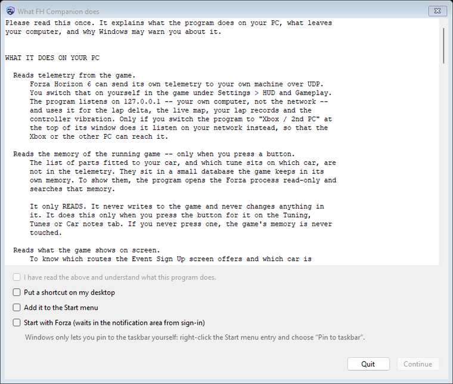
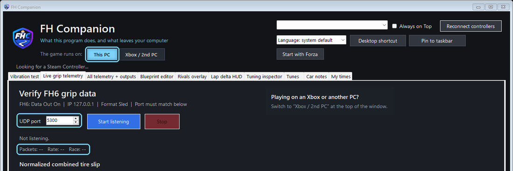
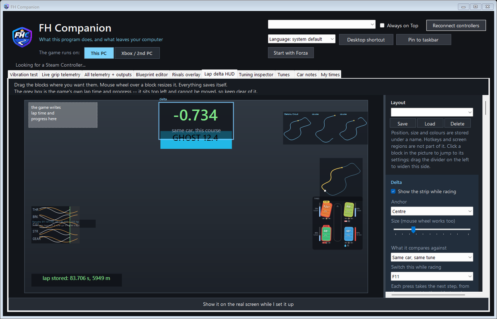
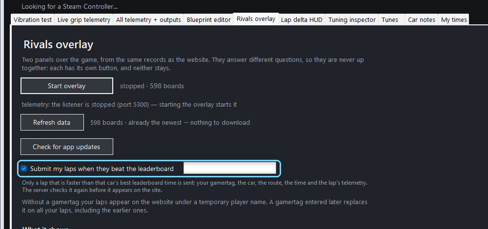

# Setting up FH Companion on this PC

For playing Forza Horizon 6 on the same Windows PC that runs FH Companion.
Playing on an Xbox, or on another PC? See [Setting up on an Xbox or a second
PC](setup_xbox.md).

There is also a video of these steps on the download page (linked at the top of the
[README](../README.md)).

## 1. Download and start

1. Download the app from the download page (linked at the top of the
   [README](../README.md)).
2. Unzip the **whole** archive into a folder of your choice. Do not drag single
   files out of it.
3. Double-click **START.cmd**. Nothing is installed and nothing is written to
   the registry.

The program is not signed with a paid certificate, so Windows may show
"Windows protected your PC". Click **More info**, then **Run anyway**.

## 2. The first start

The first start explains what the program does on your PC and what leaves it.
Read it, tick **I have read the above**, choose whether you want a desktop
shortcut, a Start menu entry or **Start with Forza**, and click **Continue**.

The link **What this program does** at the top of the window shows the text
again at any time.

## 3. Switch on Data Out in Forza

In Forza Horizon 6, open **Settings › HUD and Gameplay** and set:

| Setting | Value |
|---|---|
| Data Out | On |
| Data Out IP Address | 127.0.0.1 |
| Data Out IP Port | 5300 |
| Data Out Format | Dash |

Without this the game sends no telemetry, and every number in the app stays at
0. Play in **borderless windowed** mode: in exclusive full screen no program can
draw over the game.

## 4. Check that it arrives

At the top of the app, **The game runs on:** should say **This PC**. Open the
**Live grip telemetry** tab and drive: **Packets** and **Rate** start counting.

The port in this tab is the one Forza has to send to. If another program already
uses 5300, pick another port here and set the same one in Forza.

## 5. Choose what shows over the game

The **Lap delta HUD** tab is the editor for everything drawn over the game:
the delta strip, the ghost timer, the input traces, the live map, the tyre
overview and the car note. Drag a block where you want it; the mouse wheel
resizes it. Click a block to jump to its settings on the right.

## 6. Submit your laps (optional)

In the **Rivals overlay** tab, enter your gamertag next to **Submit my laps when
they beat the leaderboard**. A lap is sent only when it beats the best time of
that car on that route and class, and only from Rivals and Horizon Play, where
walls cost you. A gamertag is optional; without one your laps appear under a
temporary player name.

## That's it

Start a race. The delta strip, the ghost countdown and the other parts appear
while you drive and hide in the menus. For more, see [the app, tab by
tab](app_guide.md).

**Nothing shows?** Check the Data Out values, that Forza runs borderless
windowed, and that the port in the telemetry tab matches the one in Forza.
