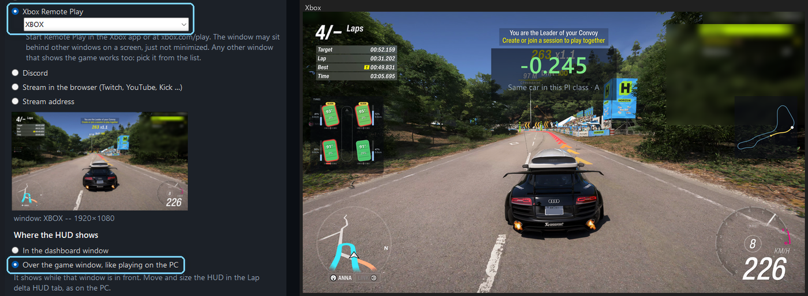

# Setting up FH Companion for an Xbox or a second PC

For playing Forza Horizon 6 on an Xbox, or on another PC, with FH Companion on
this Windows PC as a dashboard. Playing on this PC? See [Setting up on this
PC](setup_pc.md).

There is also a video of these steps on the download page (linked at the top of the
[README](../README.md)).

## 1. Download and start

1. Download the app from the download page (linked at the top of the
   [README](../README.md)).
2. Unzip the **whole** archive and double-click **START.cmd**.
3. On the first start, read the explanation, tick **I have read the above** and
   click **Continue**. If Windows shows "Windows protected your PC", click
   **More info**, then **Run anyway**.

## 2. Switch to Xbox / 2nd PC

At the top of the window, next to **The game runs on:**, click **Xbox / 2nd PC**.
The app asks once and restarts in that mode. **This PC** switches back.

In this mode the telemetry comes over your network, and the HUD shows in a
dashboard window instead of over the game. Memory reading, the tune tools and
controller haptics are off: the game and the controller are on the other device.

When Windows asks whether FH Companion may use the network, allow it on
**private networks**. Without that, the Xbox's packets never arrive.

## 3. Switch on Data Out on the Xbox

The **Live grip telemetry** tab shows exactly what to enter, as a small table:
this PC's address and the port. If the PC has more than one network, the other
addresses are listed underneath.

In Forza on the Xbox (or the other PC), open **Settings › HUD and Gameplay** and
set:

| Setting | Value |
|---|---|
| Data Out | On |
| Data Out IP Address | the address shown in the app, for example 192.168.1.20 |
| Data Out IP Port | 5300 (the port shown in the app) |

The Xbox and this PC have to be in the same network (not a guest Wi-Fi). If your
router gives this PC a new address now and then, reserve one for it in the
router, or check the address in the app when nothing arrives.

**Windows Firewall.** Right under the table the app says whether Windows lets the
telemetry in. If it does not, for example because someone clicked "Cancel" when
Windows first asked, press **Allow in Windows Firewall**. Windows asks for
permission once, and the app adds one rule for exactly that UDP port. If your
network is set to Public, the rule covers that too.

## 4. The dashboard

The dashboard window opens by itself. Put it on a second screen or next to the
TV. Double-click it or press **F11** for full screen, **Esc** to leave full
screen. The delta, the ghost timer, the input traces, the live map and the tyre
overview appear as soon as you drive.

## 5. The game's picture (optional)

With the game's picture on this PC, the app also reads the Event Sign Up screen
(route maps), My Cars (car notes) and which mode you play. Under **Game picture
(optional)** choose one of six ways; the preview underneath shows what the app
sees.

### Xbox Remote Play — play on this PC, with the HUD over the game

Remote Play shows the Xbox's picture in a window on this PC, and you play there
with the controller connected to the PC. The app can then put its HUD over that
window, just like playing Forza on a PC.

**On the Xbox, once:**

1. **Settings › Devices & connections › Remote features:** tick **Enable remote
   features**. **Test remote play** on the same page checks your network.
2. **Settings › General › Power options:** choose **Sleep**, so the PC can wake
   the Xbox.

**On this PC:**

1. Install the **Xbox** app from the Microsoft Store and sign in with the same
   account as the Xbox. (A browser works too: xbox.com/play, then your console.)
2. Connect your controller to the PC (cable, Bluetooth or the Xbox Wireless
   Adapter).
3. In the Xbox app, choose your console and **Remote play on this device**.

**In FH Companion:** under **Game picture**, choose **Xbox Remote Play**. The app
suggests the Xbox window; the list next to it offers every other window on this
PC, so any window that shows the game works the same way. Under **Where the HUD
shows**, choose **Over the game window, like playing on the PC**.

The HUD then shows over the Remote Play window while it is in front, and hides
when you switch to another program. Place and size it in the **Lap delta HUD**
tab, as on the PC. The window may sit behind other windows on a screen, just not
minimized. Windows draws a yellow frame around it while an app captures it.
**Vibration with Remote Play.** Your controller is plugged into this PC, so the
app's own vibration works as on the PC. Under **Controller**, tick **My controller
is connected to this PC (Xbox Remote Play)** and restart the app when it asks: the
Vibration test and the Blueprint editor come back. While telemetry arrives, the
app overwrites the vibration that Remote Play passes on from the Xbox, the same way
it overwrites the game's own rumble on the PC. A little can still come through,
and the trigger motors of an Xbox controller are out of the app's reach: for a
completely quiet controller, turn vibration off in the game's settings on the Xbox.

Data Out on the Xbox (step 3) is still needed: the delta and the other parts come
from the telemetry, not from the picture.

### Capture card

The Xbox's HDMI goes into the card's **HDMI in**, the card's **HDMI out** to your
TV, and the card's USB cable to this PC. You keep playing on the TV without delay.
Under **Game picture**, choose **Capture card** and pick the card. The HUD shows
in the dashboard window — put it on a second screen next to the TV.

### OBS

If OBS already shows your Xbox (a capture card or the Remote Play window as a
source): right-click the preview in OBS and choose **Windowed Projector
(Program)**. Under **Game picture**, choose **OBS**; the app finds the projector
window by itself. Here, too, the HUD can go over that window instead of into the
dashboard.

### Discord

If you stream the Xbox to a Discord voice channel, the stream shows up in Discord
on this PC. Under **Game picture**, choose **Discord**; the app finds the Discord
window by itself. Pop the stream out or switch it to full screen, so the game's
picture is not surrounded by chat and member lists.

To watch **your own** Xbox stream on this PC you need a second Discord account
there: while your account streams from the Xbox, its voice call is on the Xbox.

### A stream on Twitch, YouTube, Kick …

If you stream the Xbox to a platform — the Xbox streams to Twitch by itself
(press the Xbox button, **Capture & share**), the others go through OBS — open
the stream in the browser on this PC, in full screen or theater mode. Under
**Game picture**, choose **Stream in the browser**. The app finds the browser
window whose tab shows Twitch, YouTube, Kick, Trovo, Facebook, TikTok or Rumble;
keep the stream's tab the active one in that window.

A stream in Discord or on a platform runs a moment behind the game, so its HUD
stays in the dashboard: the HUD follows the live telemetry and would run ahead
of the picture. For reading menus, a few seconds do not matter.

### Stream address

For when the picture comes over the network from a second device, for example a
PC with the capture card that runs OBS. The Xbox itself cannot stream to an
address like this.

1. In FH Companion, under **Game picture**, choose **Stream address** and enter
   `srt://0.0.0.0:9000?mode=listener`.
2. In OBS on the other device: **Settings › Stream**, service **Custom**, server
   `srt://192.168.1.20:9000` (this PC's address from the app), then **Start
   Streaming**.

The stream is read through ffmpeg. If the app says it needs ffmpeg, run `winget
install Gyan.FFmpeg` once. When Windows asks whether ffmpeg may use the network,
allow it on private networks. A stream is a few seconds late, which is fine for
menus.

## 6. Which mode you play

Without the game's picture the app cannot see which menu a lap came from. Set
**Which mode you are playing** in the same tab, so your laps carry the right
mode. Only Rivals and Horizon Play laps count on the website.

## Nothing arrives?

- The address in Forza is exactly the one the app shows, and the port matches.
- The firewall line under the address table is green. If not, press **Allow in
  Windows Firewall** there.
- The Xbox and this PC are in the same network.
