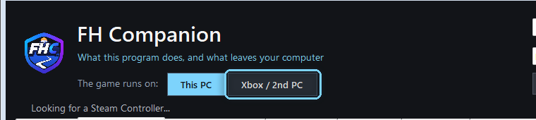
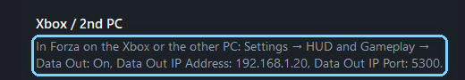
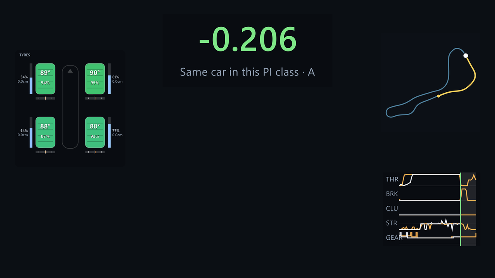
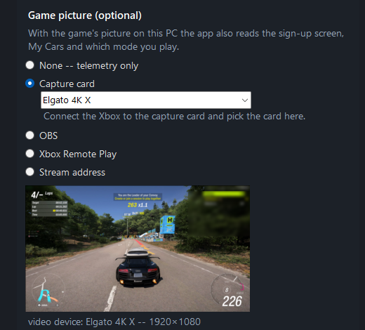

# Setting up FH Companion for an Xbox or a second PC

For playing Forza Horizon 6 on an Xbox, or on another PC, with FH Companion on
this Windows PC as a dashboard. Playing on this PC? See [Setting up on this
PC](setup_pc.md).

There is also a video of these steps on the download page (linked at the top of the
[README](../README.md)).

## 1. Download and start

1. Download the app from the download page (linked at the top of the
   [README](../README.md)).
2. Unzip the **whole** archive and double-click **START.cmd**.
3. On the first start, read the explanation, tick **I have read the above** and
   click **Continue**. If Windows shows "Windows protected your PC", click
   **More info**, then **Run anyway**.

## 2. Switch to Xbox / 2nd PC

At the top of the window, next to **The game runs on:**, click **Xbox / 2nd PC**.
The app asks once and restarts in that mode. **This PC** switches back.

In this mode the telemetry comes over your network, and the HUD shows in a
dashboard window instead of over the game. Memory reading, the tune tools and
controller haptics are off: the game and the controller are on the other device.

When Windows asks whether FH Companion may use the network, allow it on
**private networks**. Without that, the Xbox's packets never arrive.

## 3. Switch on Data Out on the Xbox

The **Live grip telemetry** tab shows this PC's address and the port:

In Forza on the Xbox (or the other PC), open **Settings › HUD and Gameplay** and
set:

| Setting | Value |
|---|---|
| Data Out | On |
| Data Out IP Address | the address shown in the app, for example 192.168.1.20 |
| Data Out IP Port | 5300 (the port shown in the app) |

The Xbox and this PC have to be in the same network (not a guest Wi-Fi). If your
router gives this PC a new address now and then, reserve one for it in the
router, or check the address in the app when nothing arrives.

## 4. The dashboard

The dashboard window opens by itself. Put it on a second screen or next to the
TV. Double-click it or press **F11** for full screen, **Esc** to leave full
screen. The delta, the ghost timer, the input traces, the live map and the tyre
overview appear as soon as you drive.

## 5. The game's picture (optional)

With the game's picture on this PC, the app also reads the Event Sign Up screen
(route maps), My Cars (car notes) and which mode you play. Under **Game picture
(optional)** choose one of four ways; the preview underneath shows what the app
sees.

- **Capture card.** The Xbox's HDMI goes into the card, and the card's output to
  your TV. Pick the card in the list.
- **OBS.** If OBS already shows your Xbox: right-click the preview in OBS and
  choose **Windowed Projector (Program)**. The app finds that window by itself.
  It may sit behind other windows on a screen, just not minimized.
- **Xbox Remote Play.** Start Remote Play in the Xbox app on this PC, or at
  xbox.com/play. The app suggests the Xbox window. It may sit behind other
  windows on a screen, just not minimized. Windows draws a yellow frame around a
  window while an app captures it.
- **Stream address.** An SRT, RTMP, RTSP or HLS address, read through ffmpeg. If
  the app says it needs ffmpeg, run `winget install Gyan.FFmpeg` once. A stream
  is a few seconds late, which is fine for menus.

## 6. Which mode you play

Without the game's picture the app cannot see which menu a lap came from. Set
**Which mode you are playing** in the same tab, so your laps carry the right
mode. Only Rivals and Horizon Play laps count on the website.

## Nothing arrives?

- The address in Forza is exactly the one the app shows, and the port matches.
- Windows allowed FH Companion on private networks. To check: **Windows
  Security › Firewall & network protection › Allow an app through firewall**.
- The Xbox and this PC are in the same network.
